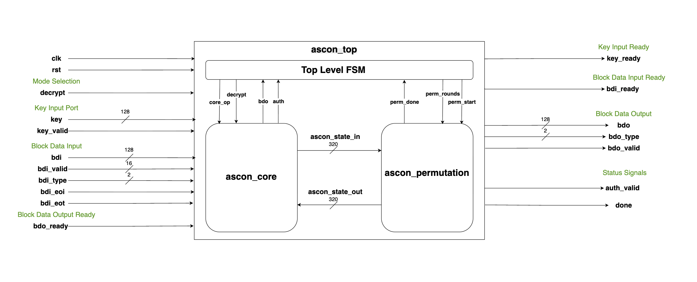

# ASCON-AEAD128

Python reference implementation and synthesizable Verilog RTL for ASCON-AEAD-128.

**Spec**: NIST SP 800-232 https://nvlpubs.nist.gov/nistpubs/SpecialPublications/NIST.SP.800-232.pdf

---

## Quick Start (Functional Testing)

### Python Reference (Software)
```bash
python3 test_ascon_kats.py
```

### Verilog RTL (Hardware)
```bash
cd test && make
```

---

## Python

NOTE: If you only care about RTL, this section is optional.

The official software reference is in `official_ascon/`.

`ascon128.py` is just an **encryption-only educational implementation** that explains the cypher more simply. It is optional for RTL users, but kept because it contains helpful comments and descriptions that some might find useful. 
`test_ascon_kats.py` validates it against official KAT vectors.

### Generate KATs (Known Answer Tests)

From the repo root, run:

```zsh
python3 official_ascon/genkat.py Ascon-AEAD128
```

This will produce both `LWC_AEAD_KAT_128_128.txt` and `LWC_AEAD_KAT_128_128.json` in the repo root.

### Run KAT validation

`test_ascon_kats.py` calls `ascon_aead128_enc(K, N, ad, pt)` from `ascon128.py` and checks ciphertext+tag against the generated KAT file.

Then run:

```zsh
python3 test_ascon_kats.py
```

The test parses `LWC_AEAD_KAT_128_128.txt`, runs your encrypt function on each vector, and checks both ciphertext and tag.

### Notes

- The KAT `CT` field is `ciphertext || tag` (tag is always 16 bytes).
- Keys and nonces in `test_ascon_kats.py` are interpreted as big-endian integers before being passed to your function.

---

## Verilog RTL: Hardware Simulation

### RTL Block Diagram



### Structure
- **rtl/**: Synthesizable RTL (3 modules)
  - `ascon_top.v` — FSM controller (17 states)
  - `ascon_core.v` — State register + 14 state/update operations
  - `ascon_permutation.v` — Permutation engine (iterative, 1 round/cycle)

- **test/**: Cocotb simulation harness
  - `test.py` — 200 test vectors (random key/nonce/data, 0–10 bytes each)
  - `Makefile` — Build script (Verilator + cocotb)

- **syn/**: Post-synthesis
  - `syn_aead.ys` — Yosys synthesis script
  - `syn_aead.v` — Gate-level netlist (18,433 cells)

### Run Simulation
```bash
cd test
make clean
make
```

### Run Synthesis
```bash
cd syn
yosys syn_aead.ys
```
